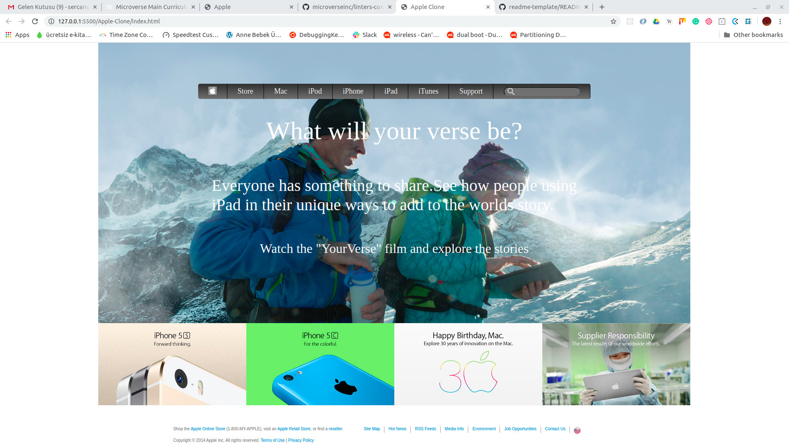

# Apple Clone

> This is the Apple's old sites' clone.

## Built With

- HTML
- CSS
- Netlify

## Live Demo

[Live Demo Link](https://angry-minsky-6b4724.netlify.app/)

## Getting Started

You can seee te page with Live Demo Link.

## Authors

👤 **Eyüp Sercan UYGUR**

- Github: [@github](https://github.com/eypsrcnuygr)
- Twitter: [@twitter](https://twitter.com/eypsrcnuygr)
- Linkedin: [linkedin](https://www.linkedin.com/in/ey%C3%BCp-sercan-uygur-a55989a1/)

👤 **Robert Loterh**

- Github: [@github](https://github.com/rloterh)
- Twitter: [@twitter](https://twitter.com/RLoterh )
- Linkedin: [linkedin](https://www.linkedin.com/in/robert-loterh-30b265135/ )

## 🤝 Contributing

Contributions, issues and feature requests are welcome!

Feel free to check the [issues page](issues/).

## Show your support

Give a ⭐️ if you like this project!

## 📝 License

This project is [MIT](lic.url) licensed.
